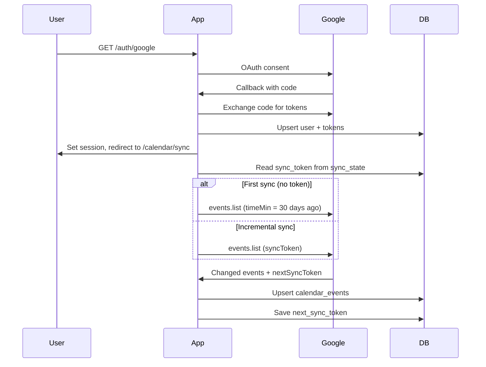
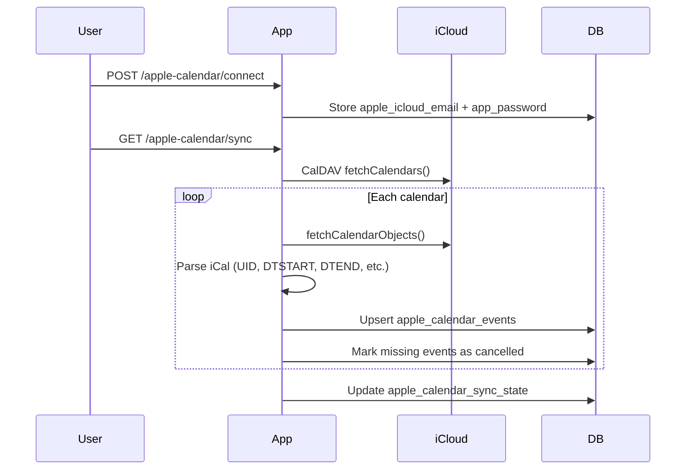
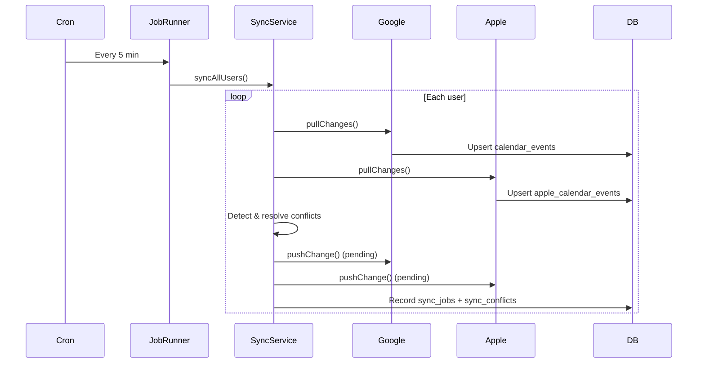

# Google Calendar Sync Demo

A Node.js/Express service that synchronizes **Google Calendar** and **Apple Calendar (iCloud)** events into **PostgreSQL**, with REST APIs for sync, listing, and event management.

---

## Project Overview

This application acts as a **calendar aggregation and sync service**. External calendars (Google and Apple) are upstream sources; the app pulls events into a local database and exposes them through authenticated REST endpoints.

- **Google** is used for identity (OAuth 2.0) and as the primary calendar provider.
- **Apple iCloud** is connected separately via CalDAV credentials attached to the same user account.
- A **background cron job** re-syncs all users every 5 minutes.

Consumers should read events from the local database (`calendar_events`, `apple_calendar_events`) rather than calling Google/Apple directly for listing and availability use cases.

---

## Features

- **Google OAuth login** with session-based authentication (sessions stored in PostgreSQL)
- **Google Calendar sync** — full initial sync (last 30 days) and incremental sync via `syncToken`
- **Google event CRUD** — create, update, and delete events, including recurring series (`all`, `this`, `future` scopes)
- **Google FreeBusy** — query busy time slots across calendars
- **Apple iCloud sync** — CalDAV integration via `tsdav` for listing calendars and syncing events
- **Apple event CRUD** — create, update, and fetch individual Apple events
- **Local persistence** — normalized event storage with raw provider payloads in JSONB
- **Scheduled background sync** — multi-provider two-way sync with conflict resolution every 5 minutes
- **Unified sync service** — provider abstraction layer supporting Google and Apple with extensible architecture
- **Conflict resolution** — automatic (`last_write_wins`, `source_wins`, `local_wins`) or manual resolution

---

## Tech Stack

| Layer | Technology |
|-------|------------|
| Runtime | Node.js (v18+ recommended) |
| Framework | Express 5 |
| Database | PostgreSQL 13+ |
| Google integration | `googleapis` (Calendar API v3, OAuth 2.0) |
| Apple integration | `tsdav` (CalDAV) |
| Sessions | `express-session` + `connect-pg-simple` |
| Scheduling | `node-cron` |
| Config | `dotenv` |

---

## Project Structure

```
gcal-sync-demo/
├── app.js                      # Entry point: Express app, sessions, cron job
├── config/
│   ├── db.js                   # PostgreSQL connection pool
│   └── google.js               # Google OAuth2 client and scopes
├── routes/
│   ├── auth.js                 # Google OAuth login/logout
│   ├── calendar.js             # Google Calendar API routes
│   ├── appleCalendar.js        # Apple iCloud CalDAV routes
│   └── sync.js                 # Unified multi-provider sync API
├── services/
│   ├── calendarService.js      # Google sync, CRUD, and DB upserts
│   ├── freebusyService.js      # Google FreeBusy checks
│   ├── appleCalendarService.js # Apple CalDAV sync, CRUD, schema setup
│   └── sync/                   # Multi-provider sync architecture
│       ├── providers/            # Provider adapters (Google, Apple)
│       ├── syncService.js      # Sync orchestrator
│       ├── syncJobRunner.js    # Background job scheduler
│       ├── conflictResolver.js # Conflict detection & resolution
│       ├── syncStrategies.js   # pull_only, push_only, two_way
│       └── syncSchema.js       # Sync tables DDL
├── package.json
├── .env                        # Environment variables (not committed)
├── test.md                     # Detailed testing guide
└── info.md                     # Extended architecture notes
```

---

## Prerequisites

| Requirement | Notes |
|-------------|-------|
| **Node.js** | v18 or later |
| **PostgreSQL** | v13 or later |
| **Google account** | With Google Calendar enabled |
| **Google Cloud project** | OAuth 2.0 credentials with Calendar API enabled |
| **Apple ID** (optional) | For Apple Calendar sync; requires an [app-specific password](https://appleid.apple.com) |

---

## Installation and Setup

### 1. Clone and install dependencies

```bash
git clone <repository-url>
cd gcal-sync-demo
npm install
```

### 2. Create the PostgreSQL database

```bash
createdb gcal_sync_demo
```

### 3. Run the base schema

Connect to your database and run:

```sql
-- Users (OAuth tokens + profile)
CREATE TABLE users (
  id SERIAL PRIMARY KEY,
  google_id VARCHAR(255) UNIQUE NOT NULL,
  email VARCHAR(255),
  name VARCHAR(255),
  access_token TEXT,
  refresh_token TEXT,
  token_expiry TIMESTAMPTZ,
  created_at TIMESTAMPTZ DEFAULT NOW()
);

-- Synced Google calendar events
CREATE TABLE calendar_events (
  id SERIAL PRIMARY KEY,
  user_id INTEGER NOT NULL REFERENCES users(id) ON DELETE CASCADE,
  google_event_id VARCHAR(255) NOT NULL,
  calendar_id VARCHAR(255) DEFAULT 'primary',
  summary TEXT,
  description TEXT,
  start_time TIMESTAMPTZ,
  end_time TIMESTAMPTZ,
  status VARCHAR(50) DEFAULT 'confirmed',
  raw_data JSONB,
  updated_at TIMESTAMPTZ DEFAULT NOW(),
  UNIQUE (user_id, google_event_id)
);

-- Incremental sync state (Google)
CREATE TABLE sync_state (
  id SERIAL PRIMARY KEY,
  user_id INTEGER NOT NULL REFERENCES users(id) ON DELETE CASCADE,
  calendar_id VARCHAR(255) DEFAULT 'primary',
  next_sync_token TEXT,
  last_synced_at TIMESTAMPTZ,
  UNIQUE (user_id, calendar_id)
);

-- Express sessions (used by connect-pg-simple)
CREATE TABLE session (
  sid VARCHAR NOT NULL PRIMARY KEY,
  sess JSON NOT NULL,
  expire TIMESTAMPTZ NOT NULL
);
CREATE INDEX IDX_session_expire ON session (expire);
```

> **Note:** Apple-specific tables and columns are created automatically on first use by `ensureAppleSchema()` in `services/appleCalendarService.js`. Google performance indexes are created lazily by `ensureGoogleSyncIndexes()` in `services/calendarService.js`.

### 4. Configure Google Cloud Console

1. Go to [Google Cloud Console](https://console.cloud.google.com/).
2. Create or select a project and enable the **Google Calendar API**.
3. Under **APIs & Services → Credentials**, create an **OAuth 2.0 Client ID** (Web application).
4. Add this authorized redirect URI:

   ```
   http://localhost:3000/auth/google/callback
   ```

5. Copy the **Client ID** and **Client Secret** into your `.env` file.

### 5. Create environment file

Copy the variables below into a `.env` file at the project root (see next section).

---

## Environment Variables (`.env`)

Create a `.env` file in the project root:

```env
# Server
PORT=3000
SESSION_SECRET=your-random-secret-string

# Google OAuth
GOOGLE_CLIENT_ID=your-client-id.apps.googleusercontent.com
GOOGLE_CLIENT_SECRET=your-client-secret
GOOGLE_REDIRECT_URI=http://localhost:3000/auth/google/callback

# PostgreSQL
DB_HOST=localhost
DB_PORT=5432
DB_NAME=gcal_sync_demo
DB_USER=postgres
DB_PASSWORD=your-db-password

# Apple iCloud (optional — used as fallback if not set per-user via /apple-calendar/connect)
APPLE_ICLOUD_EMAIL=your-apple-id@icloud.com
APPLE_APP_PASSWORD=xxxx-xxxx-xxxx-xxxx
APPLE_SERVER_URL=https://caldav.icloud.com

# Sync scheduler (optional)
SYNC_CRON_SCHEDULE=*/5 * * * *
SYNC_STRATEGY=two_way
CONFLICT_STRATEGY=last_write_wins
```

| Variable | Required | Description |
|----------|----------|-------------|
| `PORT` | No | HTTP port (default: `3000`) |
| `SESSION_SECRET` | Yes | Secret for signing session cookies |
| `GOOGLE_CLIENT_ID` | Yes | Google OAuth client ID |
| `GOOGLE_CLIENT_SECRET` | Yes | Google OAuth client secret |
| `GOOGLE_REDIRECT_URI` | Yes | Must match the URI configured in Google Cloud Console |
| `DB_HOST` | Yes | PostgreSQL host |
| `DB_PORT` | Yes | PostgreSQL port |
| `DB_NAME` | Yes | Database name |
| `DB_USER` | Yes | Database user |
| `DB_PASSWORD` | Yes | Database password |
| `APPLE_ICLOUD_EMAIL` | No | Default Apple ID for CalDAV (per-user via API is preferred) |
| `APPLE_APP_PASSWORD` | No | App-specific password for iCloud CalDAV |
| `APPLE_SERVER_URL` | No | CalDAV server URL (default: `https://caldav.icloud.com`) |
| `SYNC_CRON_SCHEDULE` | No | Cron expression for background sync (default: `*/5 * * * *`) |
| `SYNC_STRATEGY` | No | Default sync strategy: `pull_only`, `push_only`, or `two_way` (default: `two_way`) |
| `CONFLICT_STRATEGY` | No | Default conflict resolution: `last_write_wins`, `source_wins`, `local_wins`, or `manual` |

> **Security:** Never commit `.env` to version control. It is listed in `.gitignore`.

---

## How to Run the Project

### Development (with auto-reload)

```bash
npm run dev
```

### Production

```bash
npm start
# or
node app.js
```

Expected output:

```
✅ PostgreSQL connected
🚀 Server running on http://localhost:3000
```

### Quick start flow

1. Open `http://localhost:3000` in a browser.
2. Click **Login with Google** and complete OAuth consent.
3. You are redirected to `/calendar/sync` for an initial Google sync.
4. (Optional) Connect Apple Calendar via `POST /apple-calendar/connect`.
5. Use the API endpoints below to list or manage events.
6. Trigger multi-provider sync via `POST /sync` or wait for the background scheduler.

### Testing APIs with curl

Because the app uses session cookies, save cookies after browser login:

```bash
curl -c cookies.txt -b cookies.txt http://localhost:3000/calendar/events
```

See [test.md](./test.md) for a full end-to-end testing guide.

---

## API Overview

All calendar endpoints require an authenticated session (`req.session.userId`). Unauthenticated requests return `401`.

### Auth

| Method | Endpoint | Auth | Description |
|--------|----------|------|-------------|
| `GET` | `/` | No | Landing page with login link |
| `GET` | `/auth/google` | No | Start Google OAuth flow |
| `GET` | `/auth/google/callback` | No | OAuth callback (handled by Google redirect) |
| `GET` | `/auth/logout` | Session | Destroy session and redirect to `/` |

### Google Calendar

| Method | Endpoint | Description |
|--------|----------|-------------|
| `GET` | `/calendar/sync` | Trigger Google sync (full or incremental) |
| `GET` | `/calendar/events` | List synced events from local DB (`?from=`, `?to=`) |
| `GET` | `/calendar/events/:eventId` | Get a single event live from Google API |
| `POST` | `/calendar/events` | Create event (supports `recurrence` RRULE array) |
| `PUT` | `/calendar/events/:eventId` | Update event (`recurringScope`: `all` \| `this` \| `future`) |
| `DELETE` | `/calendar/events/:eventId` | Delete event (supports recurring scopes) |
| `GET` | `/calendar/freebusy` | FreeBusy check (`?timeMin=`, `?timeMax=`) |

**Create event example:**

```bash
curl -b cookies.txt -X POST http://localhost:3000/calendar/events \
  -H "Content-Type: application/json" \
  -d '{
    "summary": "Team Standup",
    "start": "2025-06-25T10:00:00",
    "end": "2025-06-25T10:30:00",
    "timeZone": "Asia/Kolkata"
  }'
```

### Apple Calendar (iCloud)

| Method | Endpoint | Description |
|--------|----------|-------------|
| `POST` | `/apple-calendar/connect` | Attach iCloud credentials to the logged-in user |
| `GET` | `/apple-calendar/calendars` | List available iCloud calendars via CalDAV |
| `GET` | `/apple-calendar/sync` | Sync Apple events into local DB |
| `GET` | `/apple-calendar/events` | List synced Apple events (`?from=`, `?to=`) |
| `GET` | `/apple-calendar/events/:eventUid` | Get a single Apple event (`?calendarId=`) |
| `POST` | `/apple-calendar/events` | Create an Apple calendar event |
| `PUT` | `/apple-calendar/events/:eventUid` | Update an Apple calendar event |

**Connect Apple account example:**

```bash
curl -b cookies.txt -X POST http://localhost:3000/apple-calendar/connect \
  -H "Content-Type: application/json" \
  -d '{
    "email": "your-apple-id@icloud.com",
    "appPassword": "xxxx-xxxx-xxxx-xxxx",
    "serverUrl": "https://caldav.icloud.com"
  }'
```

### Unified Sync Service

| Method | Endpoint | Description |
|--------|----------|-------------|
| `GET` | `/sync/status` | Provider connectivity, pending conflicts, last job |
| `GET` | `/sync/providers` | List registered providers and which are connected |
| `GET` | `/sync/strategies` | List available sync and conflict strategies |
| `POST` | `/sync` | Trigger multi-provider sync for the current user |
| `GET` | `/sync/jobs` | Sync job history (`?limit=20`) |
| `GET` | `/sync/conflicts` | List unresolved sync conflicts |
| `POST` | `/sync/conflicts/:id/resolve` | Manually resolve a conflict |
| `POST` | `/sync/run-all` | Trigger background sync for all users |

**Trigger two-way sync example:**

```bash
curl -b cookies.txt -X POST http://localhost:3000/sync \
  -H "Content-Type: application/json" \
  -d '{
    "syncStrategy": "two_way",
    "conflictStrategy": "last_write_wins",
    "providers": ["google", "apple"]
  }'
```

---

## Calendar Synchronization Flow

### Google Calendar



- **Initial sync:** Fetches events from the last 30 days using `timeMin`.
- **Incremental sync:** Uses Google's `syncToken` stored in `sync_state` to fetch only changes.
- **410 recovery:** If the sync token expires, the app deletes `sync_state` and performs a full sync.
- **Cancelled events:** Marked as `status = 'cancelled'` in the local DB rather than hard-deleted.

### Apple Calendar (iCloud)



- **Auth:** Basic authentication with iCloud email and an app-specific password (not your Apple ID password).
- **Sync type:** Full sync per calendar on each run (schema supports `ctag`/`sync_token` for future incremental sync).
- **Deletion handling:** Events no longer returned by iCloud are soft-deleted (`status = 'cancelled'`).

### Background sync scheduler

A dedicated sync job runner (`services/sync/syncJobRunner.js`) runs on a configurable cron schedule (default: every 5 minutes). Each cycle:

1. Ensures sync and Apple schemas exist.
2. Loads all users and runs `syncUser()` for each via the unified sync service.
3. Uses **two-way sync** by default: pull remote changes, detect conflicts, then push pending local changes.
4. Logs job results to the `sync_jobs` table and skips overlapping runs.



### Multi-provider sync architecture

```
services/sync/
├── providers/
│   ├── BaseCalendarProvider.js   # Abstract provider interface
│   ├── GoogleCalendarProvider.js # Google adapter
│   ├── AppleCalendarProvider.js  # Apple CalDAV adapter
│   └── index.js                  # Provider registry
├── syncStrategies.js             # pull_only, push_only, two_way
├── conflictResolver.js           # Conflict detection & resolution
├── syncSchema.js                 # sync_jobs, sync_conflicts, sync_event_state
├── syncService.js                # Orchestrator: syncUser(), syncAllUsers()
└── syncJobRunner.js              # Cron scheduler with overlap protection
```

**Sync strategies:**

| Strategy | Behavior |
|----------|----------|
| `pull_only` | Remote → local DB (inbound only) |
| `push_only` | Local pending changes → remote (outbound only) |
| `two_way` | Pull, resolve conflicts, then push (default) |

**Conflict resolution strategies:**

| Strategy | Behavior |
|----------|----------|
| `last_write_wins` | Compare timestamps; newest change wins (default) |
| `source_wins` | Remote provider always wins |
| `local_wins` | Local DB always wins; push to remote |
| `manual` | Record conflict in `sync_conflicts`; skip auto-resolution |

**Sync tables** (created automatically by `ensureSyncSchema()`):

| Table | Purpose |
|-------|---------|
| `sync_jobs` | Job history with strategy, status, and results |
| `sync_conflicts` | Detected conflicts (inbound and cross-provider) |
| `sync_event_state` | Per-event version tracking and pending push flags |
| `event_links` | Cross-provider event mapping (for future use) |

---

## Important Implementation Details

### Authentication model

- Google OAuth is the **only login mechanism**. Apple credentials are attached to the same user record after login.
- Sessions are stored in PostgreSQL (`session` table) via `connect-pg-simple`.
- Protected routes check `req.session.userId` and return `401` if absent.

### Database as source of truth for reads

- `GET /calendar/events` and `GET /apple-calendar/events` read from the **local database**, not live provider APIs.
- `GET /calendar/events/:eventId` fetches a single event live from Google.
- This design improves performance and provides a consistent query surface for downstream services.

### Token refresh (Google)

When Google refreshes an access token, the `tokens` event handler in `calendarService.js` automatically updates `users.access_token` and `users.token_expiry` in the database.

### Recurring events (Google)

Update and delete operations support three scopes:

| Scope | Behavior |
|-------|----------|
| `all` | Affects the entire recurring series |
| `this` | Affects a single instance (requires `instanceStart`) |
| `future` | Splits the series from a given instance onward |

### Separate tables per provider

Google events live in `calendar_events`; Apple events live in `apple_calendar_events`. Both share a similar shape (`user_id`, `calendar_id`, summary, times, status, `raw_data`), making it straightforward to build a unified availability layer on top.

### Lazy schema and index creation

- Apple tables/columns: created by `ensureAppleSchema()` on first Apple operation or sync run.
- Google indexes: created by `ensureGoogleSyncIndexes()` on first sync.
- Sync tables: created by `ensureSyncSchema()` on first sync operation.

---

## Troubleshooting

### `npm start` fails

Ensure dependencies are installed (`npm install`) and `.env` is configured. The app entry point is `app.js`.

### `401 Not authenticated` on API calls

- Log in via browser at `http://localhost:3000/auth/google` first.
- Ensure your HTTP client sends the `connect.sid` session cookie.
- Sessions expire after 24 hours; log in again if needed.

### OAuth callback fails or redirect URI mismatch

- Verify `GOOGLE_REDIRECT_URI` in `.env` exactly matches the URI in Google Cloud Console.
- Default: `http://localhost:3000/auth/google/callback`

### Google event create/update/delete permission errors

The app requires the full `calendar` scope (read + write). If you previously authorized with read-only scope:

1. Visit `/auth/logout`
2. Log in again at `/auth/google` (consent is forced via `prompt: 'consent'`)

### PostgreSQL connection errors

- Confirm PostgreSQL is running and credentials in `.env` are correct.
- Verify the database and tables exist (`psql -d gcal_sync_demo -c "\dt"`).
- Check server logs for `❌ DB error:` messages.

### Sync returns 0 events

- Ensure your Google account has calendar events within the last 30 days (initial sync window).
- Check `sync_state` for a stored `next_sync_token` — incremental sync only returns changes since the last sync.
- Trigger a manual sync: `GET /calendar/sync`.

### Apple sync fails — "Apple Calendar is not connected"

- Call `POST /apple-calendar/connect` with your iCloud email and app-specific password, **or**
- Set `APPLE_ICLOUD_EMAIL` and `APPLE_APP_PASSWORD` in `.env`.

### Apple CalDAV authentication fails

- Use an **app-specific password**, not your regular Apple ID password.
- Generate one at [appleid.apple.com](https://appleid.apple.com) under Security → App-Specific Passwords.
- Re-connect via `/apple-calendar/connect` after updating credentials.

### Cron sync not reflecting external changes

- Wait up to 5 minutes for the scheduled job (or trigger manually via `POST /sync`).
- Watch server logs for `⏰ Running scheduled sync job...` and `✅ Sync job completed`.
- Check job history via `GET /sync/jobs`.
- Provider-specific errors are logged per user and do not block other providers.

### Expired Google sync token (HTTP 410)

Handled automatically: the app deletes the stale `sync_state` row and re-runs a full sync. You can also manually reset:

```sql
DELETE FROM sync_state WHERE user_id = <your_user_id>;
```

Then call `GET /calendar/sync`.

---

## Additional Resources

- [test.md](./test.md) — Step-by-step testing scenarios for all features
- [info.md](./info.md) — Detailed architecture and code flow documentation
